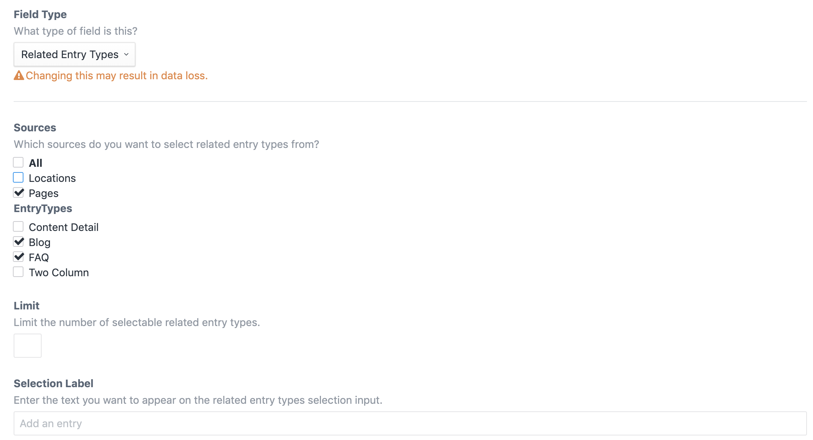

# Related Entry Types plugin for Craft CMS 3.x

A Craft Field type that allows more control over related entries.

## Requirements

This plugin requires Craft CMS 3.0.0-beta.23 or later.

## Installation

To install the plugin, follow these instructions.

1. Open your terminal and go to your Craft project:

        cd /path/to/project

2. Then tell Composer to load the plugin:

        composer require unionco/related-entry-types

3. In the Control Panel, go to Settings → Plugins and click the “Install” button for Related Entry Types.

## Related Entry Types Overview

This plugin extends the default Craft CMS Entries field, but restricts the Entry Types the user can select. 

## Configuring Related Entry Types

Each field has its own settings, just like the Craft CMS Entries field.

## Using Related Entry Types

Use this plugin in Twig and PHP just like you would use the Craft CMS Entries field.

## Related Entry Types Roadmap

Some things to do, and ideas for potential features:

* Release it

Brought to you by [UNION <abry.rath@union.co>](https://github.com/unionco)
